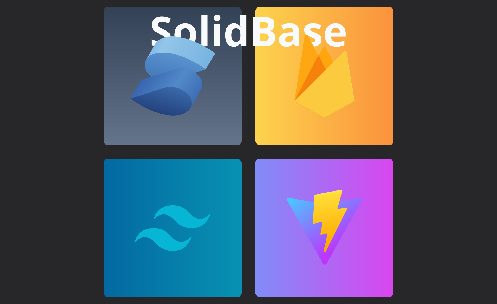

<div align="center">
  
  <h1>SolidBase</h1>
  <h3>Building a scalable frontend app made easy.</h3>
</div>
<hr>

## What's in this stack? - تعرف على التقنيات

- SolidJS
- Firebase
- Tailwindcss
- Vite
- Solid Router (Optional - إختياري)

## Available Templates - القوالب المتوفرة

- Solid Router And Firebase Setup.
- Solid Router Without Firebase Setup.
- Without Solid Router, And Firebase Setup.
- Without Solid Router, And Without Firebase Setup.

## Install The Stack - تحميل المجموعة

```js
npm create solidbase-app
```
